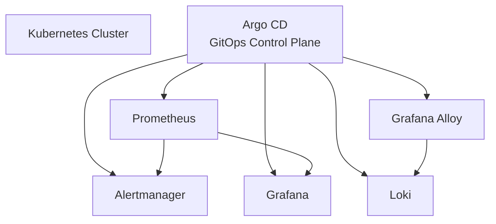

# Kubernetes Observability Stack — GitOps with Argo CD

This repository implements a **production-grade observability stack** for Kubernetes clusters using **GitOps principles** and **Argo CD**.

It provides a clean, reproducible setup for **metrics, logs, dashboards, and alerting**, following patterns commonly used in **mid–large scale production environments**.

> This repository demonstrates a production-grade observability platform
> implemented using GitOps principles, designed for technical review and
> real-world adaptation.

The repository focuses **only on the Kubernetes and GitOps layers**.

Infrastructure provisioning (cluster, networking, IAM, storage) is treated as an **external dependency** and intentionally kept out of scope.

---

## Scope & Intent

This repository is designed as:

- A **realistic GitHub demo** suitable for technical review
- A reference architecture for **GitOps-managed observability**
- A foundation that can be **hardened for production** without structural changes

Some configurations are intentionally simplified to ensure:
- fast bootstrap
- minimal external dependencies
- clarity of architecture and intent

---

## Architectural Principles

The architecture prioritizes:

- GitOps as the **single source of truth**
- Explicit separation between infrastructure and platform configuration
- Deterministic, observable system behavior
- Minimal operational magic
- Clear ownership boundaries between components

---

## Architecture Overview



> 🔎 **Detailed Architecture**
>
> The full, production-level architecture diagram (including GitOps control flow,
> CRD lifecycle, metrics and logging pipelines) is available here:
>
> ➡️ [docs/architecture-diagram.mmd](docs/architecture-diagram.mmd)

---

## Stack Components

### Metrics
- **Prometheus** (via `kube-prometheus-stack`)
- Node, Kubernetes, and workload metrics
- Custom `PrometheusRule` resources for alerting

### Alerting
- **Alertmanager**
- Explicit routing logic
- Slack receivers separated by concern:
  - platform alerts
  - workload alerts
- Noise-reduction via a dedicated `"null"` receiver

### Dashboards
- **Grafana**
- Preconfigured Loki datasource
- Admin access enabled for evaluation and platform review

### Logs
- **Grafana Loki** (SingleBinary mode)
- S3-backed storage
- Retention and compaction configured

### Log Collection
- **Grafana Alloy**
- Runs as a DaemonSet
- Discovers pods automatically
- Handles Docker and containerd logs
- Normalizes labels before ingestion

---

## GitOps Model

### Argo CD

- Acts as the **reconciliation engine**
- Uses the **App-of-Apps** pattern
- Fully automated sync with pruning and self-healing enabled

### Repository Responsibilities

**In scope**
- Platform observability services
- Alerting rules and routing
- Log ingestion and storage
- Dashboard access

**Out of scope**
- Cluster provisioning
- Cloud networking
- IAM, TLS, DNS
- Terraform state

---

## Infrastructure Boundary

The underlying AWS infrastructure and EKS cluster are provisioned via Terraform
and maintained in a **separate, authoritative IaC repository**:

https://github.com/LaurisNeimanis/aws-eks-platform

That repository is responsible for:
- EKS cluster lifecycle and versioning
- VPC, subnetting, routing, and network security boundaries
- Platform-level IAM roles and access boundaries
- Core AWS foundation resources required to run and secure the Kubernetes platform

Some infrastructure components required by this observability stack are
**intentionally not provisioned here**, including:
- S3 buckets and access policies for Loki object storage
- Kubernetes StorageClasses (e.g. gp3) used by stateful workloads
- Workload- and backend-specific IAM permissions for logs and metrics

These components are treated as **explicit external dependencies**, not hidden
assumptions, ensuring a clear separation between infrastructure provisioning
and platform/application concerns.

---

## Repository Structure

```text
├── docs/
│   ├── architecture-diagram.mmd
│   └── installation.md
│
└── gitops/
    ├── apps/
    │   └── platform/
    │       └── observability/
    │           ├── alloy/
    │           ├── kube-prometheus-stack/
    │           ├── loki/
    │           └── prometheus-rules/
    │
    ├── argo/
    │   ├── applications/
    │   ├── projects/
    │   └── root-application.yaml
    │
    ├── crds/
    │   └── prometheus-operator/
    │
    └── bootstrap/
        └── argocd/
```

---

## Alerting Design

### Routing Strategy

- **Watchdog** alerts are intentionally muted
- Kubernetes control-plane alerts are suppressed
- Workload alerts are routed separately from platform alerts
- Alert noise is controlled via a dedicated `"null"` receiver

---

## Installation & Bootstrap

This repository assumes a **pre-existing Kubernetes cluster** and Argo CD control plane.

The full bootstrap flow is documented separately:

➡️ **[Installation & Bootstrap](docs/installation.md)**

---

## Grafana Access

Grafana is enabled to allow **interactive exploration of metrics and logs** when evaluating or reviewing the observability platform.

Grafana access requires a pre-created Kubernetes Secret (`grafana-admin`), as described in the installation guide.

Authentication is intentionally externalized to keep the GitOps layer clean and avoid storing credentials in Git.

### Admin Credentials

Grafana is configured to read admin credentials from an **existing Kubernetes Secret**:

```yaml
grafana:
  admin:
    existingSecret: grafana-admin
```
Refer to the installation guide for secret creation details:

➡️ **[Installation & Bootstrap](docs/installation.md)**

### Production Considerations

In production environments, Grafana access should be hardened by:
- External secret management
- SSO (OIDC / SAML)
- Read-only dashboards for non-admin users
- Network-level access restrictions

---

## Security Disclaimer

This demo intentionally simplifies certain security aspects.

In production environments, the following must be applied:
- Secrets managed outside Git
- TLS everywhere
- IAM-based access controls
- Restricted RBAC policies

---

## Documentation

- **Architecture**
  - High-level overview: this README
  - Detailed diagram: [architecture-diagram.mmd](docs/architecture-diagram.mmd)

- **Installation**
  - [docs/installation.md](docs/installation.md)

---

## Summary

This project provides a clean, extensible, and realistic example of a GitOps-managed observability platform for Kubernetes.

It is intentionally designed to be:
- understandable
- reviewable
- extensible
- production-ready with minimal adjustments
